# SDN-Based Firewall: Orange Level Problem

**Course:** Computer Networks (UE24CS252B)  
**Institution:** PES University, Ring Road Campus  
**Developer:** Abhay Dubey H  
**Semester:** 4th Semester, B.Tech CSE

-----

## 1\. Problem Statement

The objective of this project is to develop a **Controller-Based Firewall** using the **OpenFlow 1.3** protocol. By leveraging the separation of the control plane (Ryu) and data plane (Mininet), the firewall dynamically manages traffic flow to block or allow packets based on predefined security policies.

### Core Objectives

  * **Dynamic Filtering:** Block or allow traffic based on MAC addresses, IPv4 addresses, and TCP ports.
  * **Flow Rule Design:** Implement explicit match-action rules at the switch level using prioritized flows.
  * **Persistent Logging:** Maintain real-time records of security events and unauthorized access attempts.

-----

## 2\. Installation and Environment Setup

### Prerequisites

The environment requires a Linux-based system with Python 3 and the following networking tools:

1.  **Mininet Installation**

    Use **one** of the following methods to set up the network emulator:

    #### **Method 1: Ubuntu Package Manager**
    ```bash
    sudo apt update
    sudo apt install mininet -y
    ```
    #### **Method 2: Source Installation**
    ```bash
    # Step 1: Install dependencies
    sudo apt install git build-essential python3-pip -y

    # Step 2: Clone & Install
    git clone https://github.com/mininet/mininet
    cd mininet
    sudo ./util/install.sh -a
    ```
    ### **B. Ryu Controller Setup**
    ```bash
    # Install Ryu Framework
    pip3 install ryu
    pip3 install eventlet==0.30.2  # Fixes common async compatibility issues
    ```

2.  **Ryu Controller Setup**

    ```bash
    pip3 install ryu
    pip3 install eventlet==0.30.2
    ```

-----

## 3\. Execution Guide

### Preparation and Cleanup

### **Step 1: Clone the Files**
Download the custom topology and firewall logic to your system:

```bash
git clone <YOUR_GITHUB_REPO_URL>
cd <YOUR_REPO_NAME>
```
### **Step 2: Clean and Prepare**
To prevent port binding conflicts or stale virtual interfaces, ensure the environment is cleared before execution.

```bash
sudo killall ryu-manager
sudo mn -c
```

**Verification of Flow Deletion:**

### Launching the System

1.  **Terminal 1 (Ryu Controller):**

    ```bash
    ryu-manager firewall.py
    ```
> 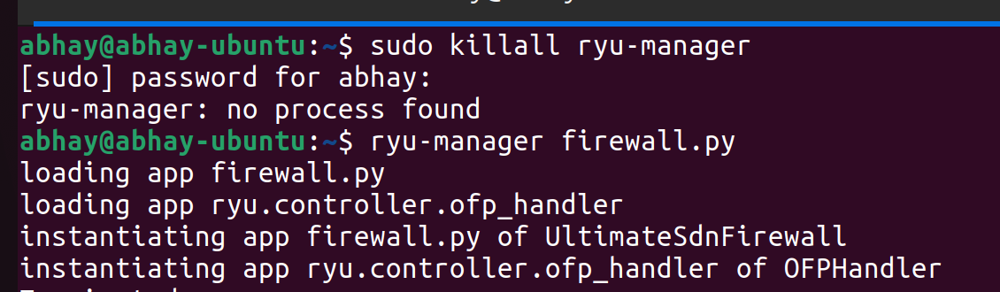

2.  **Terminal 2 (Mininet Topology):**

    ```bash
    sudo python3 topo.py
    ```
> 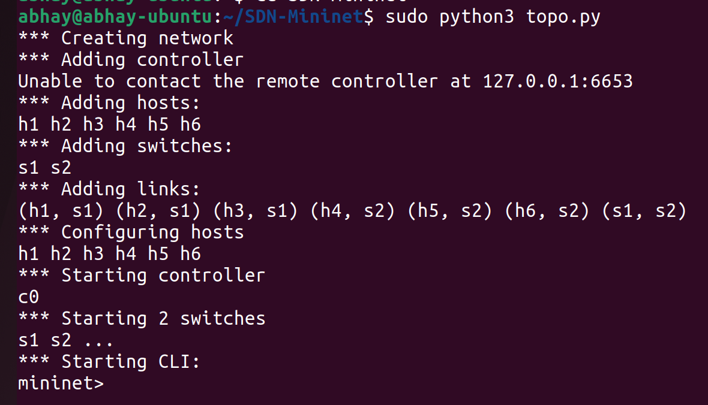


**How My Topology is:**
**h1 <->]                      [ <-> h4**
**h2 <->] <--> s1 <--> s2 <--> [ <-> h5**
**h3 <->]                      [ <-> h6**

-----

## 4\. Test Scenarios and Functional Validation

### Inside Mininet(Terminal 2)

### Scenario 1: Allowed Traffic (Forwarding)

Hosts not restricted by the firewall policy should communicate successfully.

  * **Test:** `h1 ping -c 3 h2`
  * **Result:** Successful ICMP echo request/reply.

**Proof of Allowed Execution:**

  * This is how pinging a host from s2 to s1 would look like(using HostName)
  > 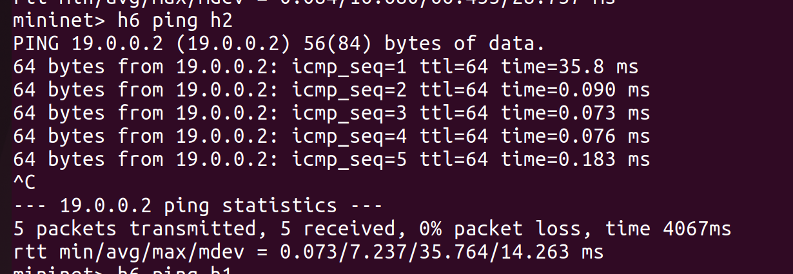

  * This is how pinging a host from s2 to s1 would look like(using IP Address)  
  > 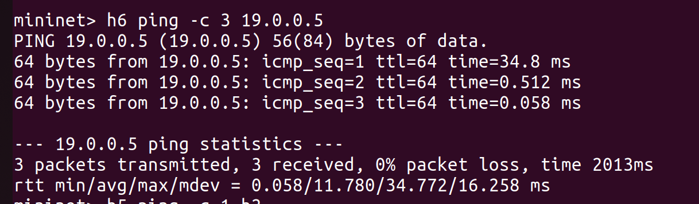

### Scenario 2: Blocked Traffic (Firewall Filtering)

The firewall drops packets matching restricted MAC, IP, or Port criteria.

  * **MAC Block:** `h1 ping h3` 
  ** Any host trying to reach h3, will be blocked, and vice-versa(Bidirectional Block)

  * **IP Block:** `h1 ping h4`
  ** Any host trying to reach h4, will be blocked, and vice-versa(Bidirectional Block)

  * **Port Block:** `h1 curl 19.0.0.2:80`
  ** Any of the hosts trying to communicate on *Port 80*, will be blocked

**Proof of Blocked Execution:**

  * **MAC Block:**
  > 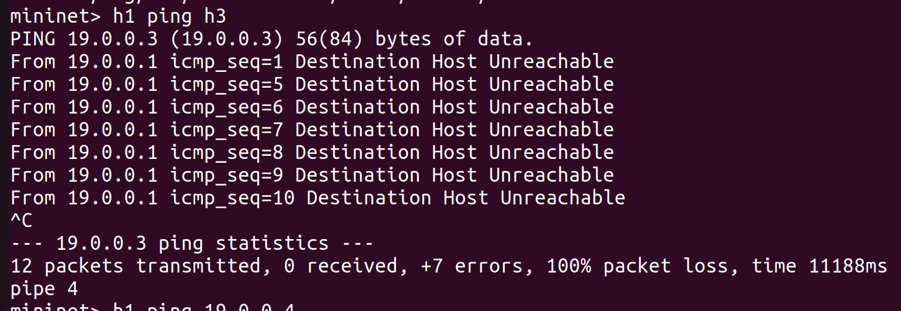  
  > 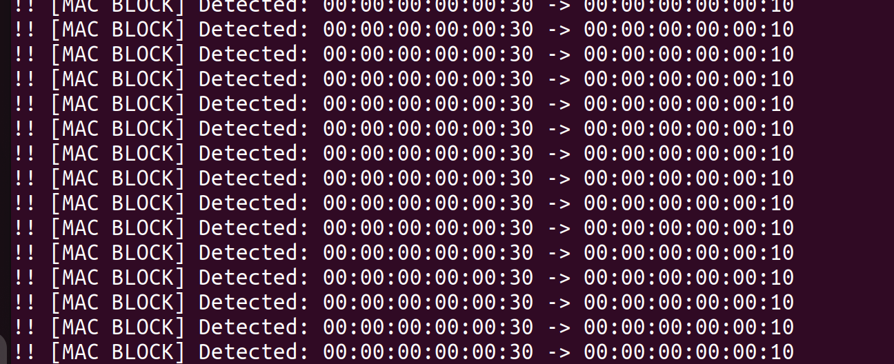

  * **IP Block:**
  > 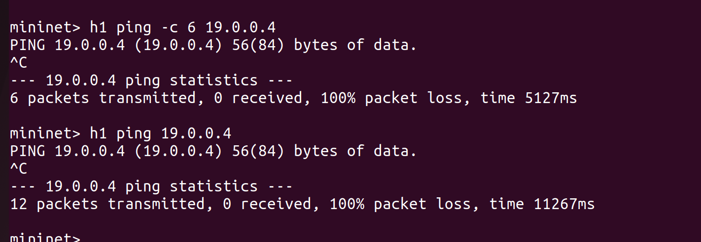
  > 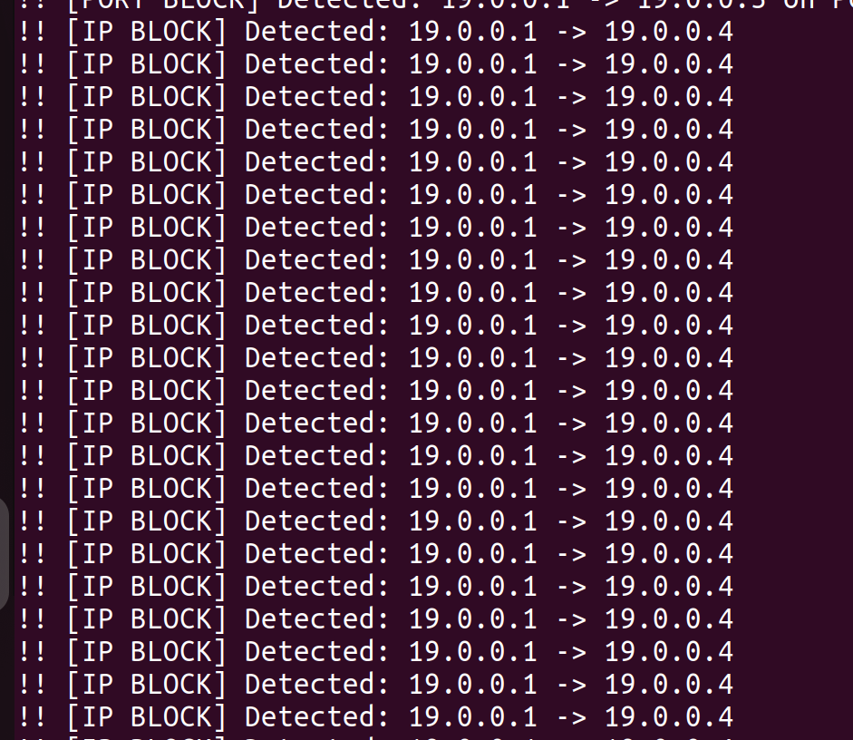

  * **Port Block:**
  > 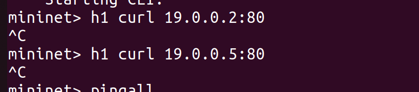
  > 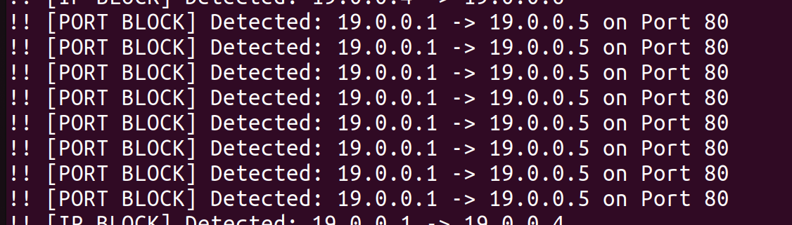
  
### Network Connectivity Table:
  * `pingall`
  > 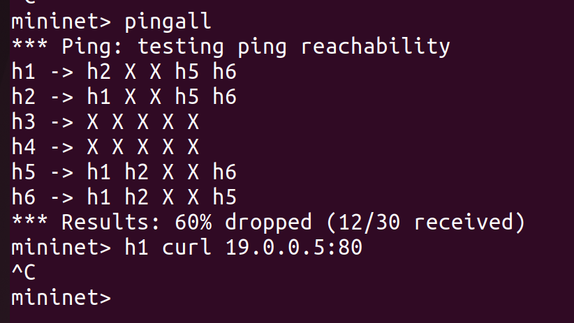
  
  > 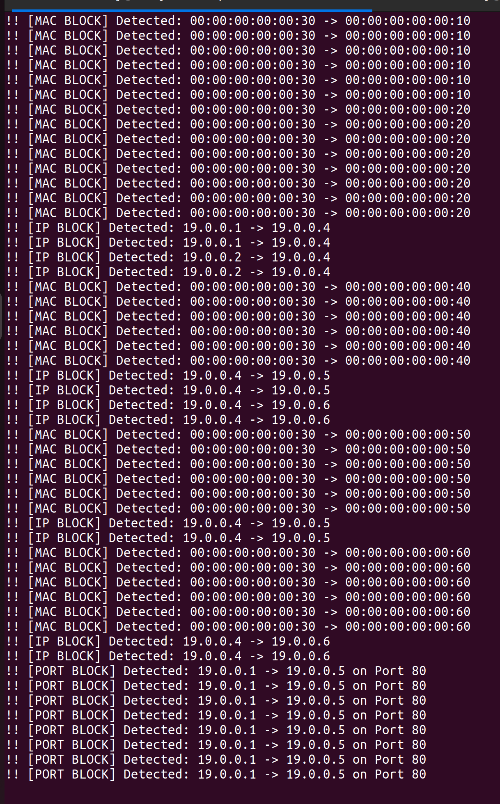

-----

## 5\. Performance Observation and Analysis

### Flow Table Inspection

Explicit OpenFlow 1.3 rules are installed by the controller to manage traffic at the switch level.

```bash
sudo ovs-ofctl -O OpenFlow13 dump-flows s1
```
> 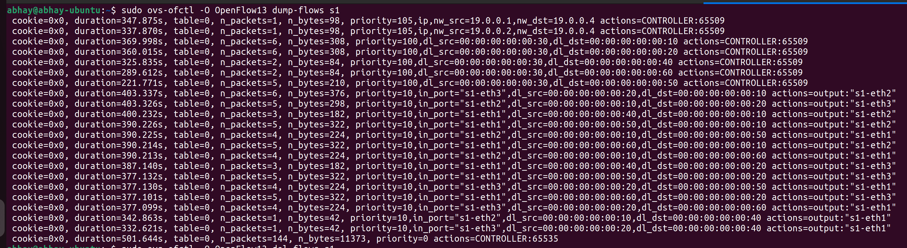

```bash
sudo ovs-ofctl -O OpenFlow13 dump-flows s2
```
> 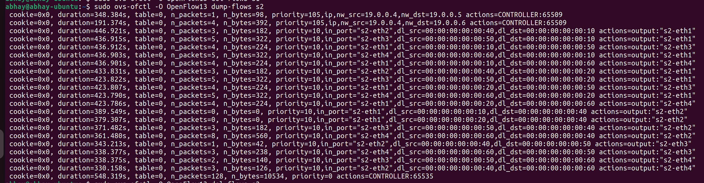

### Performance Metrics

1.  **Latency Analysis:**
    Measurements show higher latency for the first packet due to the **Packet-In** event and subsequent rule installation.
    > 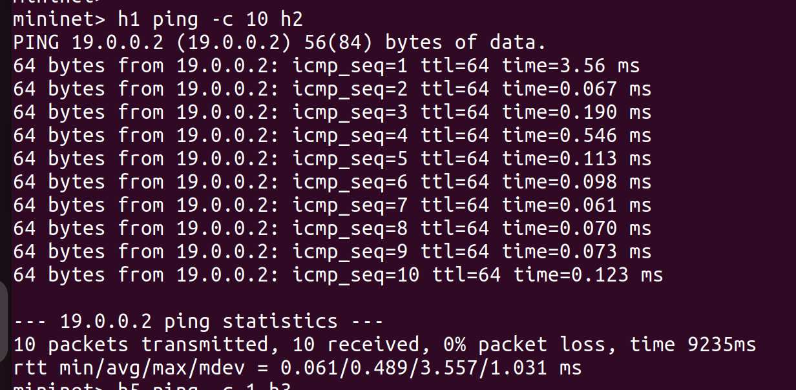
    
2.  **Throughput Analysis:**
    The `iperf` tool is used to measure the maximum bandwidth allowed across the multi-hop switch fabric.
    > 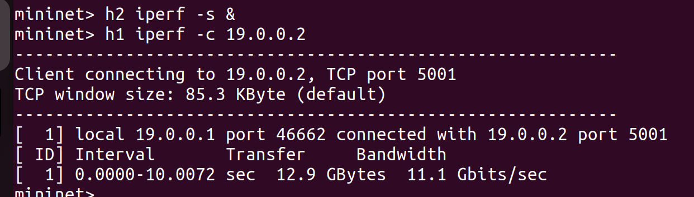

### **After running everything**
* **Terminal 1 (Ryu):** Should show the text `!! [PORT BLOCK] or [MAC BLOCK] Detected or [IP BLOCK] Detected (similar to what you see in the log_file)` in bright logs.
* **Terminal 2 (Mininet):**
* **Terminal 3 (Ubuntu):** Should show the `dump-flows` results with the actual rules.

### Refer these pictures

>[!Terminal1](./Screenshots/Terminal1.png)

>[!Terminal2](./Screenshots/Terminal2.png)

>[!Terminal3](./Screenshots/Terminal3.png)
-----

## 6\. Monitoring and Security Logs

All detected violations are recorded in a persistent text file named `firewall_log.txt`. This includes the timestamp, the type of block (MAC/IP/Port), and the source/destination details.

```bash
cat firewall_log.txt
```
> 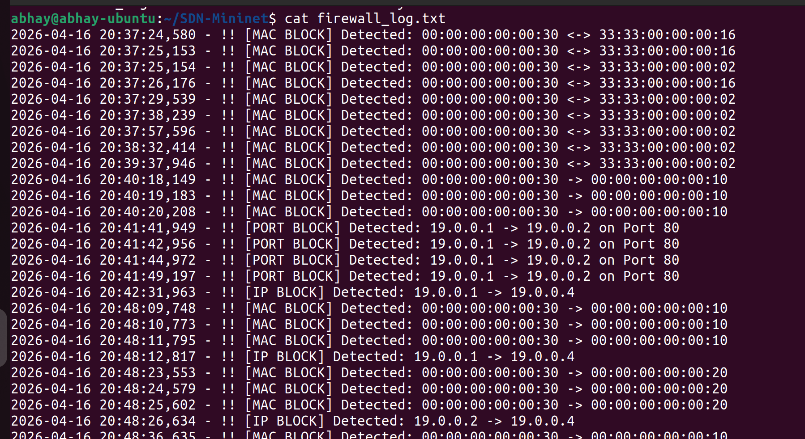

-----

## 7\. Scalability and Modification

### Expanding the Topology

To add new hosts or switches, modify the `build()` method in `topo.py`:

```python
# Adding h7 to Switch 2
h7 = self.addHost('h7', ip='19.0.0.7', mac='00:00:00:00:00:70')
self.addLink(s2, h7)
```

### Updating Security Policies

To update the blocklist, modify the initialized lists in `firewall.py`:

```python
self.BLOCK_MAC_LIST = ['00:00:00:00:00:30', '00:00:00:00:00:70']
self.BLOCK_IP_LIST = ['19.0.0.4', '19.0.0.7']
self.BLOCK_PORT_LIST = [80, 443]
```

-----

## 8\. References

  * OpenFlow Switch Specification v1.3.0
  * Ryu Controller Documentation (ryu.readthedocs.io)
  * Mininet Walkthrough and API Reference (mininet.org)
  * Gemini AI for few prompts and instructions.

-----
