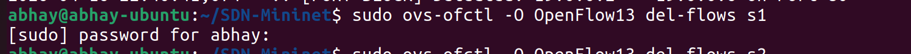
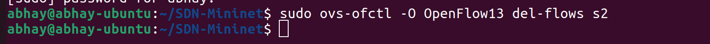

# SDN-Based Firewall: Orange Level Problem
**Course:** Computer Networks (UE24CS252B)  
**Institution:** PES University  
**Developer:** Abhay Dubey H  

---

## 1. Problem Statement
The objective of this project is to develop a **Controller-Based Firewall** using the **OpenFlow 1.3** protocol. By leveraging the separation of the control plane (Ryu) and data plane (Mininet), the firewall dynamically manages traffic flow to block or allow packets based on predefined security policies.

### **Core Objectives:**
* **Dynamic Filtering:** Block/Allow traffic based on MAC, IP, and Port.
* **Flow Rule Design:** Implement explicit match-action rules at the switch level.
* **Logging:** Maintain persistent records of security events.

---

## 2. Installation & Environment Setup

### **A. Mininet Installation**
Use **one** of the following methods to set up the network emulator:

#### **Method 1: Ubuntu Package Manager**
```bash
sudo apt update
sudo apt install mininet -y
```

#### **Method 2: Source Installation**
```bash
# Step 1: Install dependencies
sudo apt install git build-essential python3-pip -y

# Step 2: Clone & Install
git clone https://github.com/mininet/mininet
cd mininet
sudo ./util/install.sh -a
```

### **B. Ryu Controller Setup**
```bash
# Install Ryu Framework
pip3 install ryu
pip3 install eventlet==0.30.2  # Fixes common async compatibility issues
```

---

## 3. How to Run the Project

### **Step 1: Clone the Files**
Download the custom topology and firewall logic to your system:
```bash
git clone <YOUR_GITHUB_REPO_URL>
cd <YOUR_REPO_NAME>
```

### **Step 2: Clean and Prepare**
Always ensure no previous instances of Ryu or Mininet are interfering with the new execution.
```bash
# Terminate any running Ryu processes
sudo killall ryu-manager

# Cleanup Mininet virtual interfaces and temporary files
sudo mn -c
```

### **Step 3: Execution Order**
1.  **Terminal 1 (Controller):**
    ```bash
    ryu-manager firewall.py
    ```
> 
   
2.  **Terminal 2 (Mininet):**
    ```bash
    sudo python3 topo.py
    ```
    
> 
---

## 4. Test Scenarios & Expected Output

### **Scenario 1: Allowed vs Blocked (Functional Correctness)**
| Traffic Type | Command | Expected Result |
| :--- | :--- | :--- |
| **Allowed** | `h1 ping -c 3 h2` | Packets transmitted successfully. |
| **MAC Block** | `h1 ping h3` | 100% packet loss (Blocked). |
| **IP Block** | `h1 ping h4` | 100% packet loss (Blocked). |
| **Port Block** | `h1 curl 19.0.0.2:80` | Connection fails/times out. |

> 

> 

> 

> 

> 

---

### **After running everything**
* **Terminal 1 (Ryu):** Should show the text `!! [PORT BLOCK] or [MAC BLOCK] Detected or [IP BLOCK] Detected (similar to what you see in the log_file)` in bright logs.
* **Terminal 2 (Mininet):**
* **Terminal 3 (Ubuntu):** Should show the `dump-flows` results with the actual rules.

---

## 5. Performance Observation & Analysis

### **A. Flow Table Inspection**
To verify that the controller is installing **Explicit Flow Rules** (OpenFlow 1.3), run(in Terminal 3):
```bash
sudo ovs-ofctl -O OpenFlow13 dump-flows s1
```
> 

> 

> 

> 

### **B. Performance Metrics**
| Metric | Result | Analysis |
| :--- | :--- | :--- |
| **Latency** | Run `h1 ping -c 10 h2` | The 1st packet has higher RTT due to the **Packet-In** event. |
| **Throughput** | Run `h1 iperf -c 19.0.0.2` | Shows maximum bandwidth allowed by the switch. |

> 

> 

---

## 6. Monitoring & Logs
The firewall maintains a persistent log of all security violations in `firewall_log.txt`. 

**To view the logs:**
```bash
cat firewall_log.txt
```
> 
---

## 7. References & Citations
* *OpenFlow Switch Specification v1.3.0*
* *Ryu Controller Documentation (ryu.readthedocs.io)*
* *Mininet Walkthrough (mininet.org)*

---

## 8. How to Add New Hosts(Scalability)

To expand the network or block new targets, you need to update two files.

### 1. Update the Topology (`topo.py`)
To add a physical host to the Mininet simulation:
* **Add the host:** Use `self.addHost()` and assign it a unique IP and MAC address.
* **Create the link:** Use `self.addLink()` to connect that host to a specific switch (`s1` or `s2`).

**Example:** Adding `h7` to Switch 2:
```python
# Inside the build() method of PracticalFirewallTopo
h7 = self.addHost('h7', ip='19.0.0.7', mac='00:00:00:00:00:70')
self.addLink(s2, h7)
```

### 2. Update the Firewall Rules (`firewall.py`)
To apply security policies to your new host, update the `__init__` method in the `UltimateSdnFirewall` class. The code uses **Python lists**, making it easy to add multiple entries.

**Example:** Blocking the new host `h7` and a new port 443 :
```python
def __init__(self, *args, **kwargs):
    super(UltimateSdnFirewall, self).__init__(*args, **kwargs)
    
    # Add the new MAC or IP to the existing lists
    self.BLOCK_MAC_LIST = ['00:00:00:00:00:30', '00:00:00:00:00:70'] # Added h7 MAC
    self.BLOCK_IP_LIST  = ['19.0.0.4', '19.0.0.7']                  # Added h7 IP
    self.BLOCK_PORT_LIST = [80, 443]                                # Added HTTPS Port
```

---


